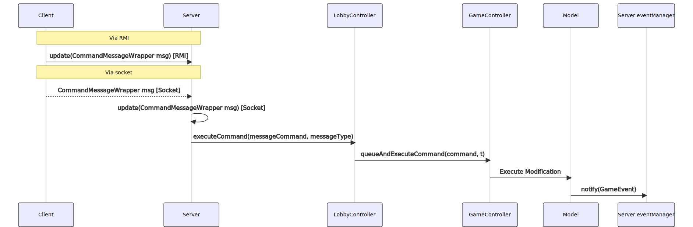

# Multiple games: one server to rule them all

Our game's server architecture, built to support multiple games concurrently, ensures seamless operation and high performance through the careful use of design patterns and data structures.

## Sequence diagram

## The Heart of Communication

At the heart of our communication pipeline is the `LobbyController` class, a critical component that acts as a bridge between clients and their respective games. It receives messages from clients through either Remote Method Invocation (RMI) or Socket, based on the client's preference.

`LobbyController` employs a mapping system to manage active games. Each game is uniquely identified by a string representing its name. This name is used as a key in a map that associates each game with its corresponding `GameController` instance.

## Handling Commands and Actions

Every action performed by a user is translated into a command which is sent to the server,
which forwards it to the `LobbyController`, which in turn dispatches it to the associated
`GameController`. To ensure responsiveness and concurrency control, the `GameController`
adds the command to a queue, allowing it to return control to the `LobbyController`
immediately without having to wait for the execution of the command.
The command queue is managed by a single-threaded executor to guarantee that commands are processed sequentially
and in the order they were received, thereby avoiding concurrency issues.