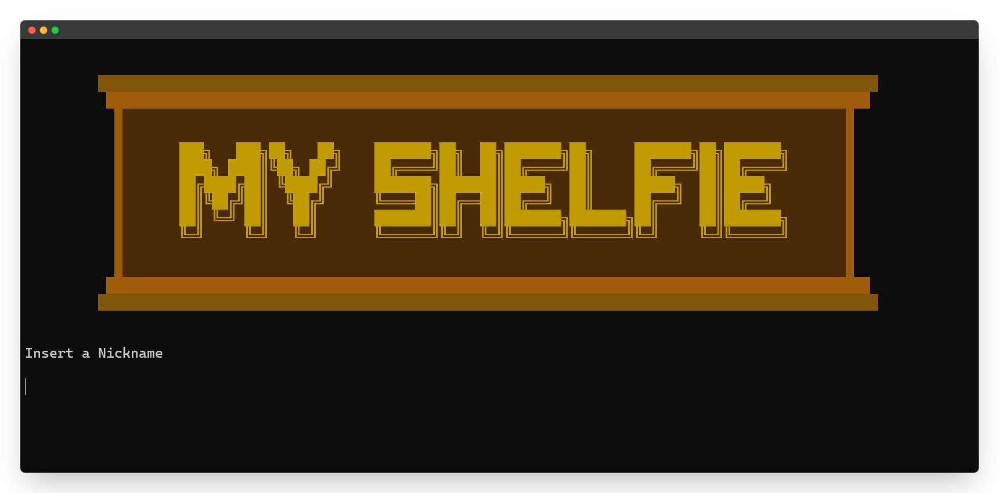
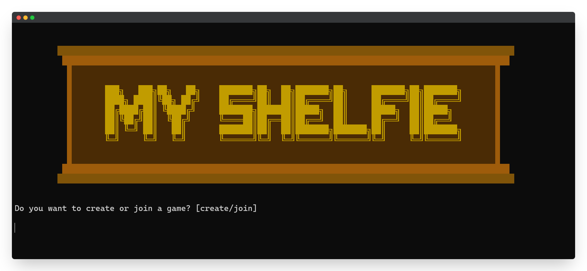
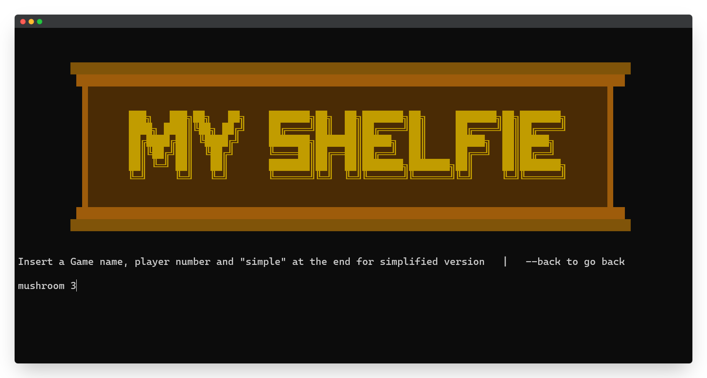
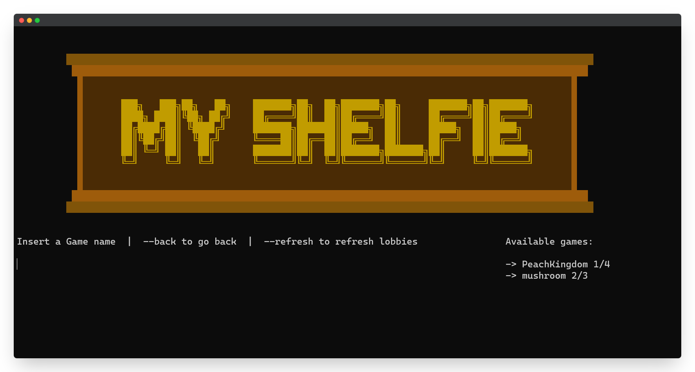
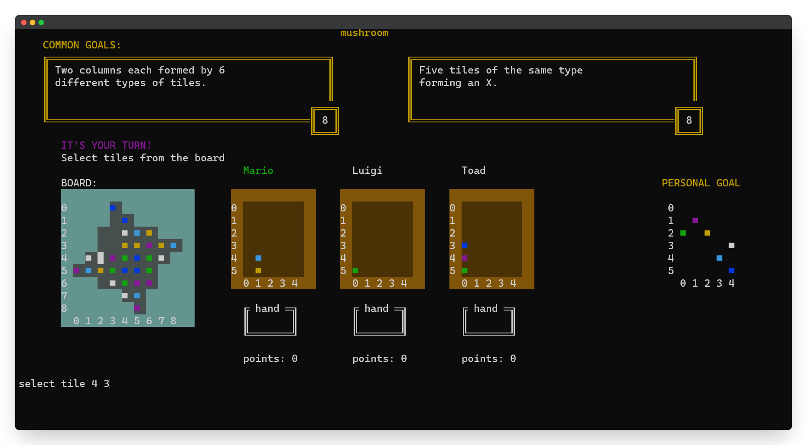
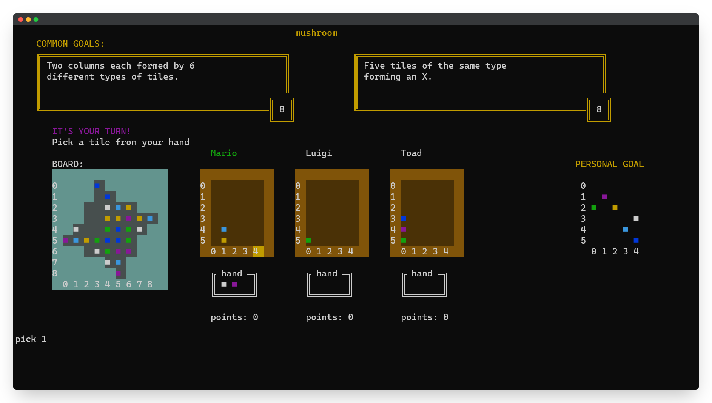
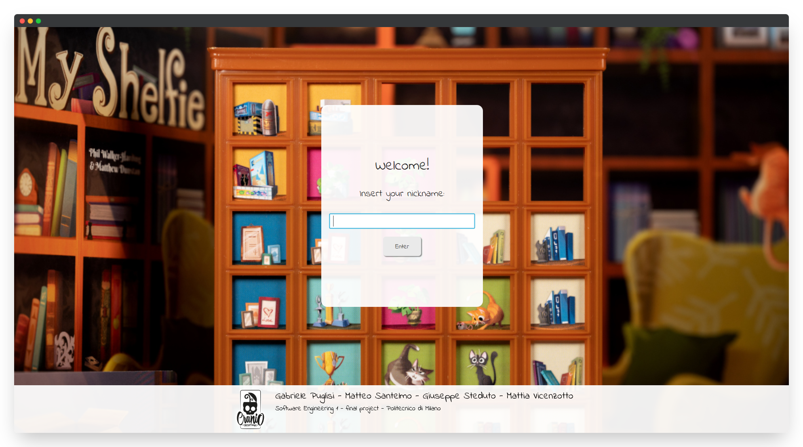

# Gameplay Gallery

Still not convinced about how great our game is? Here are some screenshots and videos of the game in action:

## CLI

Below are some screenshots of the CLI (textual interface) version of the client.

<figure markdown>

  <figcaption>The first phase of the game is the login: insert your nickname!</figcaption>
</figure>

<figure markdown>

  <figcaption>After login, you can choose to either create a new game, or join an existing one</figcaption>
</figure>

<figure markdown>

  <figcaption>Let's create the game "mushroom" with 3 players!</figcaption>
</figure>

<figure markdown>

  <figcaption>Another player will select the "mushroom" game, and the fun can start!</figcaption>
</figure>

<figure markdown>

  <figcaption>It's your turn! Select the tiles from the board...</figcaption>
</figure>

<figure markdown>

  <figcaption>...and place them inside the bookshelf!</figcaption>
</figure>

## GUI

For the graphical interface, let's do something different: a video!

<figure markdown>

  <figcaption>Again, let's start by typing in the nickname</figcaption>
</figure>

<figure markdown>

  <figcaption>Now you can select the game that you want to join</figcaption>
</figure>

<figure markdown>

  <figcaption>Then, enjoy the game in a completely new fashion!</figcaption>
</figure>