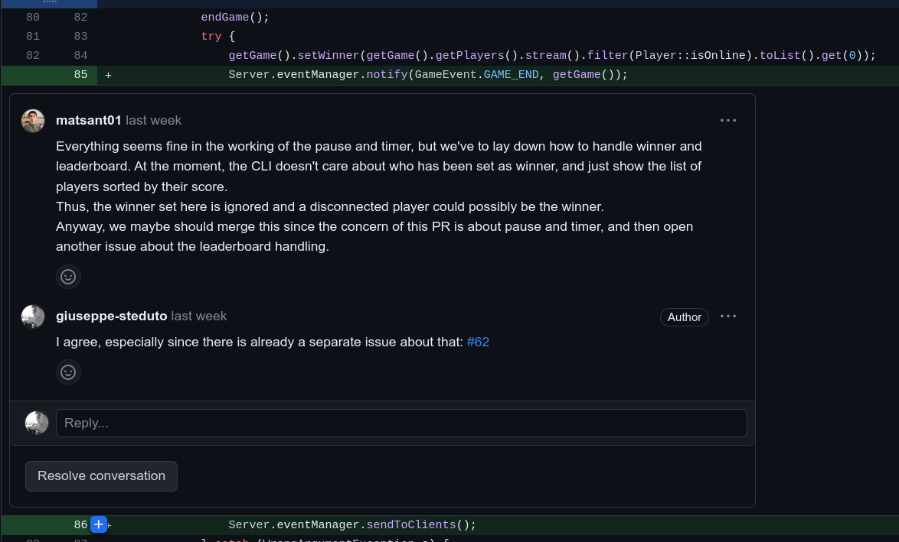
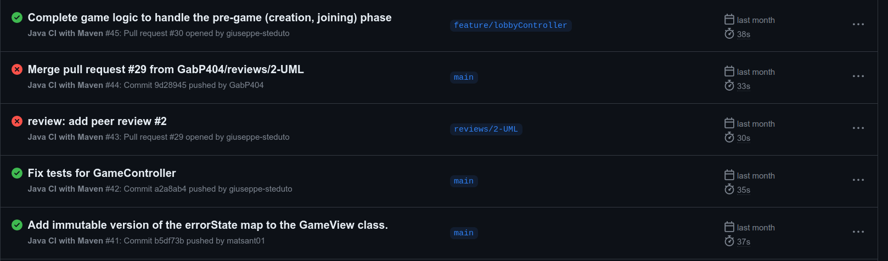

# Tools and development process

## Maven

We used Maven as our build automation tool. It allowed us to easily manage the dependencies of the project, and to
automatically build the project and run the tests.
Using the `pom.xml`, we were able to include inside the jar file all the dependencies needed to run the game, with
a particular focus on making the client application cross-platform: we included the JavaFX dependencies for all the
supported platforms (Windows, Linux and macOS), like this:

```xml
<!-- JavaFX - win -->
...omitted for brevity...

<dependency>
  <groupId>org.openjfx</groupId>
  <artifactId>javafx-fxml</artifactId>
  <version>
    19
  </version>
  <classifier>win</classifier>
</dependency>

<!-- JavaFX - mac-aarch64OS -->
    ...omitted for brevity...

<dependency>
  <groupId>org.openjfx</groupId>
  <artifactId>javafx-fxml</artifactId>
  <version>
    19
  </version>
  <classifier>mac-aarch64</classifier>
</dependency>

<!-- JavaFX - linux -->
...omitted for brevity...

<dependency>
  <groupId>org.openjfx</groupId>
  <artifactId>javafx-fxml</artifactId>
  <version>
    19
  </version>
  <classifier>linux</classifier>
</dependency>
```

## Git and GitHub

We used **Git** as our version control system, and **GitHub** as our remote repository. We used the GitHub **issues** to keep track
of the tasks to be done, and to assign them to the team members, to comments 

### Branching model and code review process

We used a **scaled trunk-based branching model**, with a single `main` branch and a single remote. We used the `main` branch as our
"production" branch, and we used feature branches to develop new features. Whenever a feature was ready, we opened a pull
request to merge it into the `main` branch: using GitHub really made it easy for us to review the code of our
teammates, and to discuss about it:


Thanks to GitHub, it was easy to link the issues with the related pull requests, and to automatically close the issues
when the pull request was merged into the `main` branch. 

### GitHub Actions

We set up GitHub Actions to automatically run the tests whenever a pull request was opened, or
whenever a commit was pushed to the `main` branch. This allowed us to quickly spot any regression, and to fix it
before merging the code into the `main` branch (at least until we ran out of free minutes, and we had to disable the 
workflow).



## IntelliJ IDEA

We used IntelliJ IDEA as our IDE. It allowed us to easily manage the dependencies of the project, and to
automatically build the project and run the tests.
We particularly liked the integration with GitHub, and the ability to choose different run configurations, both for testing
and for running the application, while being able to easily visualize the code coverage of the tests.