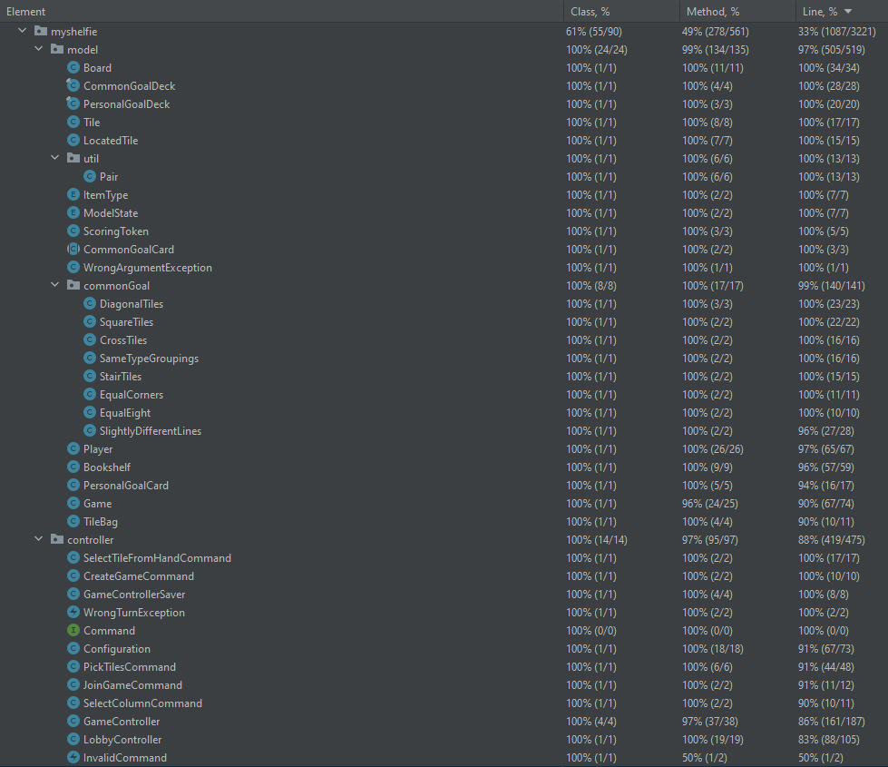

# Test coverage report

In adherence to the best practices of software engineering, we made sure that the core
components of our code are well tested. By using a mix of unit tests and integration tests,
we have achieved a class and method coverage of 100% and an overall line coverage of 92%.

Here you can see the summary table of the coverage report:

| Package | Class coverage | Method coverage | Line |
|---------|----------------|-----------------|------|
| `model` | 100% | 99%             | 97%  |
| `controller` | 100% | 97%             | 88%  |

And a more detailed report:

